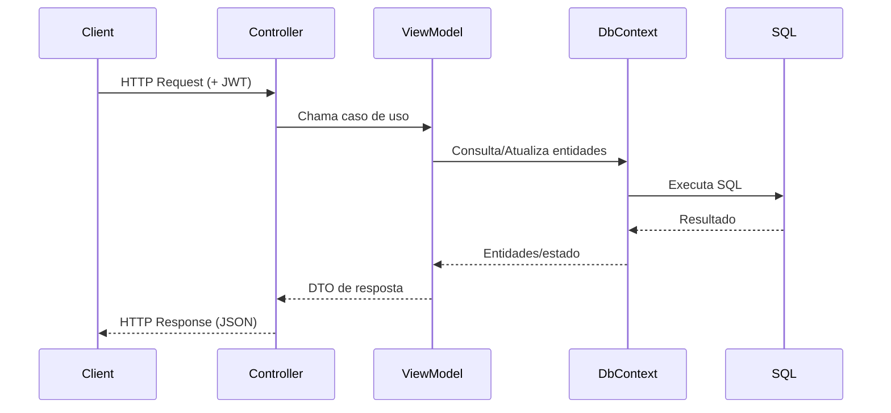

# ESG Resíduos API

API REST em ASP.NET Core para gestão de resíduos com foco ESG: pontos de coleta, tipos de resíduos, coletas, destinações e alertas automáticos.

---

## Tecnologias

- .NET 8 / ASP.NET Core
- Entity Framework Core
- SQL Server (LocalDB no dev)
- JWT Bearer Authentication
- Swagger/OpenAPI
- xUnit (projeto de testes)
- Docker (Dockerfile)

---

## Estrutura

```text
EsgResiduos.Api/
├── Controllers/
├── ViewModels/
├── Models/
├── DTOs/
│   ├── Request/
│   └── Response/
├── Data/
├── Exceptions/
├── Migrations/
└── Program.cs

EsgResiduos.Tests/
```

---

## Arquitetura (camadas + fluxo)

### Diagrama de camadas (MVVM + infraestrutura)

```mermaid
flowchart TB
    C[Controllers\n(View HTTP/API)] --> VM[ViewModels\n(Regras de negócio)]
    VM --> M[Models\n(Entidades de domínio)]
    VM --> DTO[DTOs\n(Request/Response)]
    VM --> DB[(AppDbContext / EF Core)]
    DB --> SQL[(SQL Server)]
    C --> EX[GlobalExceptionHandler\n(ProblemDetails)]
    C --> AUTH[JWT AuthN/AuthZ]
```

### Fluxo de requisição



> Em caso de erro, a exceção é tratada pelo `GlobalExceptionHandler`, retornando `ProblemDetails` com status HTTP adequado (404, 409, 500 etc.).

---

## Configuração

### appsettings (estado atual)

`EsgResiduos.Api/appsettings.json`
- `ConnectionStrings:DefaultConnection` vem vazio por padrão.
- JWT já possui valores de desenvolvimento.

`EsgResiduos.Api/appsettings.Development.json`
- Usa LocalDB por padrão:

```json
{
  "ConnectionStrings": {
    "DefaultConnection": "Server=(localdb)\\MSSQLLocalDB;Database=EsgResiduosDb;Trusted_Connection=True;TrustServerCertificate=True"
  }
}
```

Se necessário, sobrescreva por variável de ambiente:

```powershell
$env:ConnectionStrings__DefaultConnection="Server=...;Database=EsgResiduosDb;User Id=sa;Password=...;TrustServerCertificate=True"
$env:Jwt__Key="chave-jwt-com-32+-caracteres"
```

---

## Como executar (local)

Na raiz do repositório:

```powershell
dotnet restore
dotnet build EsgResiduos.sln
dotnet run --project EsgResiduos.Api
```

Se estiver dentro de `EsgResiduos.Api/`, basta:

```powershell
dotnet run
```

Em ambiente de desenvolvimento, o terminal imprime o link do Swagger (`/swagger`).

---

## Docker

Existe `EsgResiduos.Api/Dockerfile` no projeto.

### Build

```powershell
docker build -t esg-residuos-api ./EsgResiduos.Api
```

### Run

```powershell
docker run --rm -p 8080:8080 -e ConnectionStrings__DefaultConnection="Server=host.docker.internal;Database=EsgResiduosDb;User Id=sa;Password=...;TrustServerCertificate=True" -e Jwt__Key="chave-jwt-com-32+-caracteres" --name esg-residuos-api esg-residuos-api
```

> Observação: atualmente não há `docker-compose.yml` versionado no repositório.

---

## Autenticação

- Endpoints públicos: `/api/auth/register`, `/api/auth/login`
- Demais endpoints exigem JWT Bearer.

Header:

```text
Authorization: Bearer {token}
```

---

## Endpoints

### Auth (`/api/auth`)
- `POST /api/auth/register`
- `POST /api/auth/login`

### Waste Types (`/api/wastetypes`)
- `GET /api/wastetypes`
- `GET /api/wastetypes/{id}`
- `POST /api/wastetypes`
- `PUT /api/wastetypes/{id}`
- `DELETE /api/wastetypes/{id}`

### Collection Points (`/api/collectionpoints`)
- `GET /api/collectionpoints`
- `GET /api/collectionpoints/{id}`
- `POST /api/collectionpoints`
- `PUT /api/collectionpoints/{id}`
- `DELETE /api/collectionpoints/{id}`

### Collections (`/api/collections`)
- `GET /api/collections`
- `GET /api/collections/{id}`
- `POST /api/collections`
- `DELETE /api/collections/{id}`

### Destinations (`/api/destinations`)
- `GET /api/destinations`
- `GET /api/destinations/{id}`
- `POST /api/destinations`

### Collection Alerts (`/api/collectionalerts`)
- `GET /api/collectionalerts`
- `GET /api/collectionalerts/{id}`

Paginação de listagens:

```text
?page=1&pageSize=10
```

---

## Regras importantes de DELETE (estado atual)

Para evitar erro de FK no banco:

- `DELETE /api/collections/{id}`
  - remove `Destinations` relacionadas;
  - desassocia `CollectionAlerts` (`CollectionId = null`);
  - então remove a coleta.

- `DELETE /api/wastetypes/{id}`
  - retorna **409 Conflict** se houver coletas vinculadas.

- `DELETE /api/collectionpoints/{id}`
  - retorna **409 Conflict** se houver coletas vinculadas;
  - remove alertas do ponto antes da exclusão.

---

## Tratamento de erros

A API usa handler global e responde em formato Problem Details.

- `NotFoundException` → `404`
- `AppException` → status definido na exceção (ex.: `400`, `409`)
- Exceções não tratadas → `500`

---

## Testes

Projeto: `EsgResiduos.Tests`

```powershell
dotnet test
```

---

## Licença

MIT.
